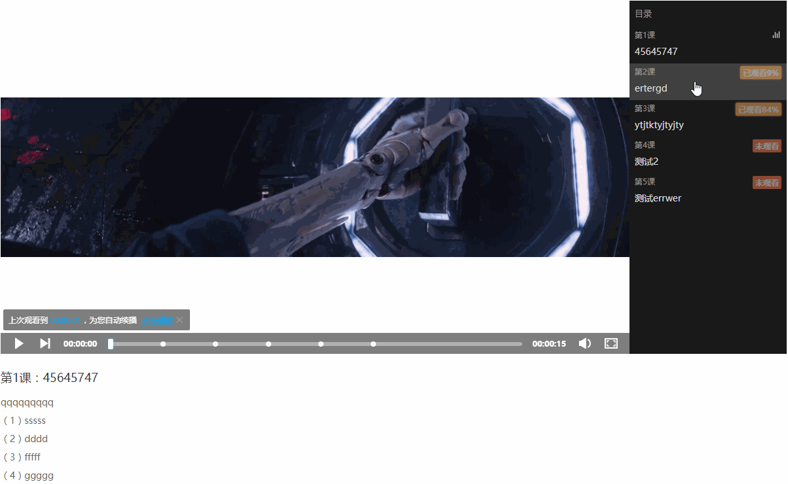

# vue3Example

## Project setup
```
npm install
```

### Compiles and hot-reloads for development
```
npm run serve
```

### Compiles and minifies for production
```
npm run build
```

### Run your tests
```
npm run test
```

### Lints and fixes files
```
npm run lint
```

### Customize configuration
See [Configuration Reference](https://cli.vuejs.org/config/).


## 组件

### inputBox
1. 功能描述

inputBox组件由标题、可变类型输入框、错误提示三部分组成，适用于数据填写与校验，减少提交数据的复杂度。


2. 技术面
* 父子组件通信：props、emit（自定义事件）
* 双向绑定：v-model
* 自定义input：type、placeholder、name、maxlength、pattern、title、required、disabled、readOnly、blur、focus
* 生命周期
* watch监听父组件值变化
* 父组件调用子组件方法：$refs

3. 组件属性
* 盒子宽度：boxWidth: Number
* 标题：subtitle: String
* input type：inputType: String
    * password2:自定义类型，此时密码框可切换明文和密文
* input name：inputName: String
* input value：inputValue: String
* input disabled：disable: Boolean
* input readonly：readOnly: Boolean
* input maxlength：len: Number
* input pattern：patternReg: String
* input title：validTitle: String
* input required 提示文字：required: String
* 数据校验规则 patternInfo: Array
    * 样例
    ```js
    patternInfo:{
      //校验顺序按书写顺序
      //符合此正则时报错
      {
        pattern: /1\d{10}/,
        info: '样例格式不正确'
      },
      //字符串相等报错
      {
        pattern: "123456",
        option: '=',
        info: '不能与123456相同，请重新输入'
      },
      //字符串不等报错
      {
        pattern: "123456",
        option: '!',//可不传option
        info: '与123456相同，请重新输入'
      },
      //输入长度大于指定数报错，可用len取代
      {
        pattern: 5,
        option: '>',
        info: '样例格式不正确'
      },
      //输入长度等于指定数报错
      {
        pattern: 5,
        option: '=',
        info: '样例格式不正确'
      },
      //输入长度小于指定数报错
      {
        pattern: 5,
        option: '<',//可不传option
        info: '样例格式不正确'
      },
      //直接报错
      {
        pattern: true,
        info: '样例格式不正确'
      },
      //不报错,密码判断相等或不等时使用,结合下方组件事件
      {
        pattern: false,
        info: '新密码不能与旧密码相同，请重新输入/两次密码不一致，请重新输入'
      }
    }
    ```

4. 组件事件
* beforeFocus：focus逻辑执行前emit的事件
* focused：focus逻辑执行后emit的事件
* beforeBlur：focus逻辑执行前emit的事件
    * 此处一般用作密码判断相等或不等：父组件可在此时同步其它组件数据，修改pattern为false的项
* blured：focus逻辑执行后emit的事件

5. 父组件可调用方法
* focusAction：focus逻辑（emit事件）
* blurAction：blur逻辑（emit事件、数据校验、可提交标志）
* getVal：获取input value
* getSubmitState：是否可提交，是否校验完全通过
* showServerInfo：显示服务器返回错误

### dragSlider
1. 功能描述

dragSlider由拖动滑块和错误提示组成，用于拖动验证功能。


2. 技术面
* 父子组件通信：props
* 父组件请求页面：axios
* 路由跳转：this.$router.push

3. 组件属性
* 无

4. 组件事件
* 无

5. 父组件可调用方法
* slideOK：是否验证完成
* showDragInfo：显示服务器返回错误
* reset：重置组件

### errorCode
1. 功能描述

errorCode用于页面不能正常显示（403,404,500）时，显示此组件。

2. 技术面
* 父子组件通信：props

3. 组件属性
* 错误码：code: Number

4. 组件事件
* 无

5. 父组件可调用方法
* 无

## 页面

### 登录页/login
1. 功能描述

不同url复用页面，且只刷新部分组件

2. 技术面
* 路由监听：watch

3. 实现
```js
created: function() {
  this.page = this.$route.name;
},
watch: {
  // url改变，不切换组件
  '$route' (to, from) {
    this.page = to.name;
  }
}
```

### 资料页/material
1. 功能描述

单个文件下载和文件批量下载

2. 技术面
* a的download属性
* 模拟点击：this.$refs.myFile[i].click();

### 异常页/exception
1. 功能描述

* 页面不能正常显示（403,404,500）时，显示此页面

2. 技术面
* 获取路由参数：this.$route.params/query.code

### 自定义视频页
1. 功能描述

自定义视频进度条，暂停、播放、全屏、拖动进度条、视频章节



2. 技术面
* video操作
* 记录视频观看进度

### 移动端登录页/m/lodin
1. 功能描述

* 页面显示带rem的文字

2. 技术面
* flexible引入与index去除meta
* scss pxToRem函数与引入

## 其它功能
### 跨域配置vue.config.js和nginx
```js
module.exports = {
    publicPath: process.env.NODE_ENV === 'production' ? '/' : '/',
    // outputDir: 在npm run build时 生成文件的目录 type:string, default:'dist'
    // outputDir: 'dist',
	  outputDir: 'wwwroot',
    // pages:{ type:Object,Default:undefind } 
    devServer: {
        port: 8080, // 端口号
        host: 'localhost',
        https: false, // https:{type:Boolean}
        open: true, //配置自动启动浏览器
        //proxy: '' // 配置跨域处理,只有一个代理
        proxy: {
            '/api': {
                target: 'http://localhost:7675/api',
                ws: true,
                changeOrigin: true,
                pathRewrite:{
                    '^/api':'' // 需要rewrite重写的
                }
            }
        },  // 配置多个代理
    }
}
```
```txt
    server {
        listen       8083;
        server_name  localhost;
        
        location / {
            root   D:\wwwroot;
            try_files $uri $uri/ /index.html;
            index  index.html index.htm;
        }

        location /api {
            add_header 'Access-Control-Allow-Origin' '*';
            proxy_pass http://localhost:7675/api;
        }
        
        error_page   500 502 503 504  /50x.html;
        location = /50x.html {
            root   html;
        }
    }
```

### 全局引入组件axios cookie

main.js
```js
import cookie from 'vue-cookies'
import axios from 'axios'
import VueAxios from 'vue-axios'

Vue.use(cookie);
Vue.use(VueAxios,axios);
```
